# Welcome

I build cybersecurity, detection engineering, automation, and machine learning homelabs focused on incident response, Active Directory security, SIEM analysis, scripting, and defensive validation.

## Pinned Projects

| Project | Summary |
|---|---|
| [Windows Incident Response Lab](https://github.com/Maunton/Windows-IR-Lab) | Windows IR and detection lab using Sysmon, PowerShell, ATT&CK mapping, and HTML reporting. |
| [University Incident Response Case Study](https://github.com/Maunton/University-Incident-Response-Case-Study) | Incident response investigation focused on log analysis, attack reconstruction, and reporting. |
| [Active Directory Security Monitoring with Splunk](https://github.com/Maunton/Active-Directory-Splunk) | AD security monitoring lab using Splunk to analyze authentication events and suspicious activity. |
| [Active Directory LLMNR Poisoning & Mitigation Lab](https://github.com/Maunton/Active-Directory-LLMNR-Mitigation-Lab) | Demonstrates LLMNR poisoning, NTLM hash capture, password cracking, and defensive hardening. |

## Featured Cybersecurity Projects

- **[Windows Incident Response Lab](https://github.com/Maunton/Windows-IR-Lab)**  
  Built a Windows incident response and detection lab using Sysmon, PowerShell, ATT&CK mapping, and HTML reporting to investigate host-based activity and document findings.

- **[University Incident Response Case Study](https://github.com/Maunton/University-Incident-Response-Case-Study)**  
  Documented a university-level incident response investigation focused on log analysis, attack reconstruction, and defensive reporting.

- **[Active Directory Security Monitoring with Splunk](https://github.com/Maunton/Active-Directory-Splunk)**  
  Built a virtualized Active Directory lab with Splunk to analyze Windows authentication events, investigate failed logons, and identify attack-relevant activity through SIEM-based log analysis.

- **[Active Directory LLMNR Poisoning & Mitigation Lab](https://github.com/Maunton/Active-Directory-LLMNR-Mitigation-Lab)**  
  Demonstrated LLMNR poisoning, NTLM hash capture, password cracking, and mitigation through Group Policy and NetBIOS hardening in a controlled Active Directory lab.

## Additional Security and Automation Projects

- **[Active Directory, Splunk, and Atomic Red Team](https://github.com/Maunton/ActiveDirectory-Splunk-Atomic_Red_Team)**  
  Used Atomic Red Team to generate security-relevant activity and validate Splunk visibility within an Active Directory lab.

- **[Phishing Incident Response Playbook](https://github.com/Maunton/Phishing-Playbook)**  
  Created a phishing investigation and response playbook to support repeatable security operations workflows.

- **[Tenable Nessus Essentials Scan](https://github.com/Maunton/Nessus-Scan)**  
  Performed vulnerability scanning in a lab environment using Nessus Essentials to identify and review host weaknesses.

- **[SOAR and EDR Integration and Automation Project](https://github.com/Maunton/SOAR-EDR-Integration-and-Automation-Project)**  
  Built a security automation lab integrating SOAR and EDR concepts to improve response workflows and investigation efficiency.

- **[SOC Automation Project](https://github.com/Maunton/SOC-Automation-Project)**  
  Developed a SOC-focused automation lab demonstrating security workflow orchestration, event handling, and operational efficiency.

## Software and Machine Learning Projects

- **[Personal Expense Tracker](https://github.com/Maunton/Personal-Expense-Tracker)**  
  Built a personal finance tracking application to organize and monitor expenses.

- **[Task Manager Login](https://github.com/Maunton/Task-Manager-Login)**  
  Developed a task management application with authentication and user access control.

- **[Employee Turnover Analytics using Machine Learning](https://github.com/Maunton/Employee-Turnover-Analytics-using-Machine-Learning)**  
  Applied machine learning techniques to analyze employee turnover patterns and build predictive insights from HR.

<!-- CERTIFICATIONS-START -->
## Certifications and Certificates

### Cybersecurity & API Security

<table>
  <tr>
    <td align="center" width="150">
       
      <b>API Security for Connected Cars and Fleets</b>
    </td>
    <td align="center" width="150">
       
      <b>OWASP API Security Top 10</b>
    </td>
    <td align="center" width="150">
       
      <b>Securing API Servers</b>
    </td>
  </tr>
  <tr>
    <td align="center" width="150">
       
      <b>APISEC University</b>
    </td>
    <td align="center" width="150">
       
      <b>Google Cybersecurity + Security+</b>
    </td>
    <td align="center" width="150">
       
      <b>CompTIA Security+</b>
    </td>
  </tr>
</table>

### Governance, Risk, Compliance & Security Training

<table>
  <tr>
    <td align="center" width="180">
      <a href="certificates/nist-rmf-sp800-37.png">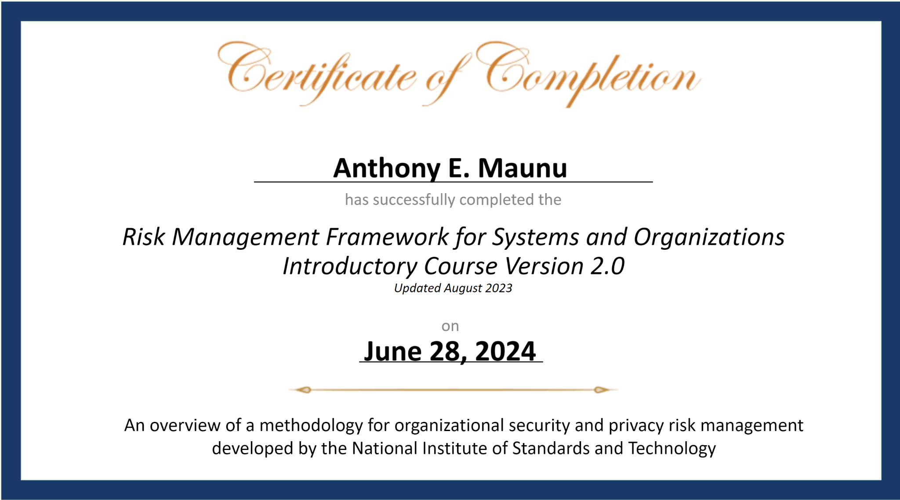</a> 
      <b>NIST RMF SP 800-37</b>
    </td>
    <td align="center" width="180">
      <a href="certificates/nist-sp800-53.png">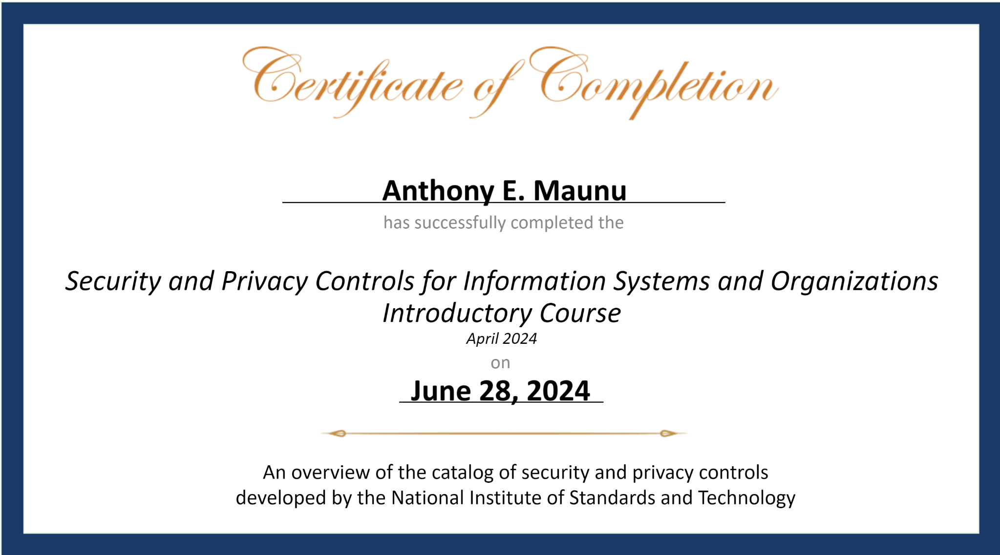</a> 
      <b>NIST SP 800-53 Controls</b>
    </td>
    <td align="center" width="180">
      <a href="certificates/nist-sp800-53a.png">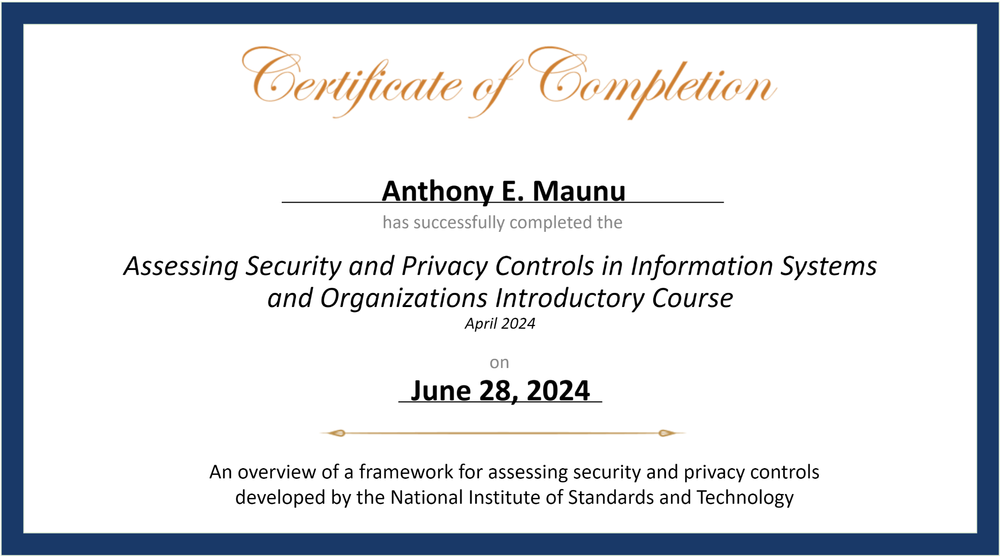</a> 
      <b>NIST SP 800-53A Assessment</b>
    </td>
  </tr>
  <tr>
    <td align="center" width="180">
      <a href="certificates/nist-sp800-53b.png">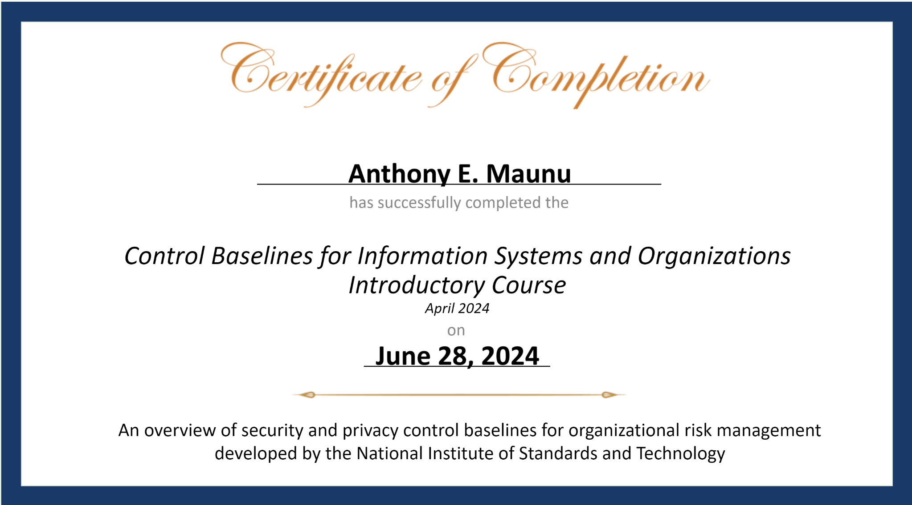</a> 
      <b>NIST SP 800-53B Baselines</b>
    </td>
    <td align="center" width="180">
      <a href="certificates/simplilearn-security-plus.png">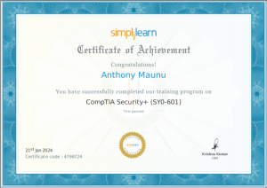</a> 
      <b>CompTIA Security+ Training</b>
    </td>
    <td align="center" width="180">
      <a href="certificates/simplilearn-ceh-v12.png">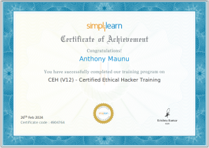</a> 
      <b>CEH v12 Training</b>
    </td>
  </tr>
  <tr>
    <td align="center" width="180">
      <a href="certificates/simplilearn-cissp.pdf">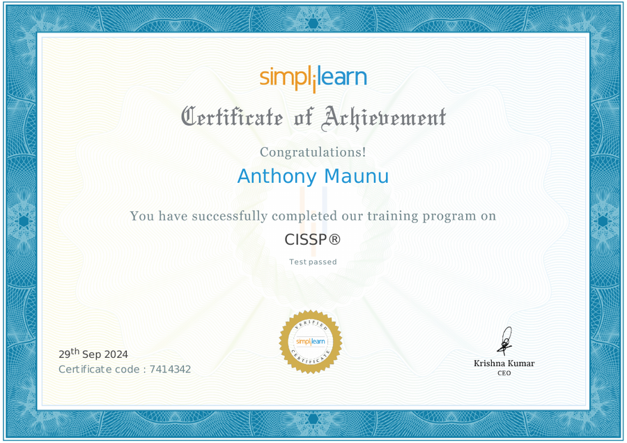</a> 
      <b>CISSP Training</b>
    </td>
    <td align="center" width="180">
      <a href="certificates/cyber-security-expert.pdf">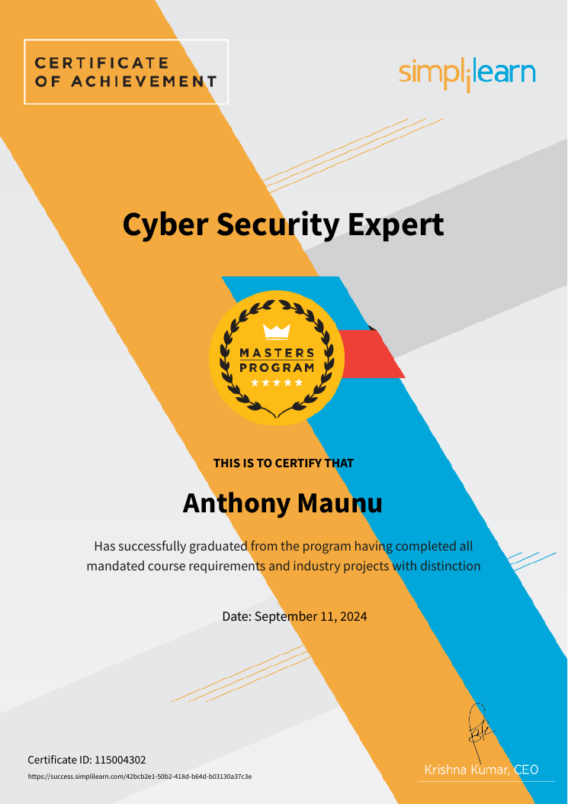</a> 
      <b>Cyber Security Expert</b>
    </td>
    <td align="center" width="180">
      <a href="certificates/comptia-network-plus.pdf">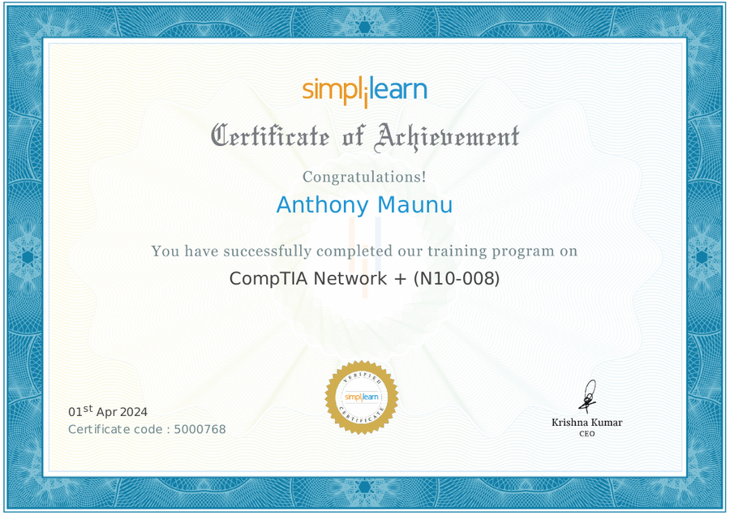</a> 
      <b>CompTIA Network+ Training</b>
    </td>
  </tr>
</table>

### Artificial Intelligence, Machine Learning & Data Science

<table>
  <tr>
    <td align="center" width="180">
      <a href="certificates/caltech-ai-ml-bootcamp.pdf">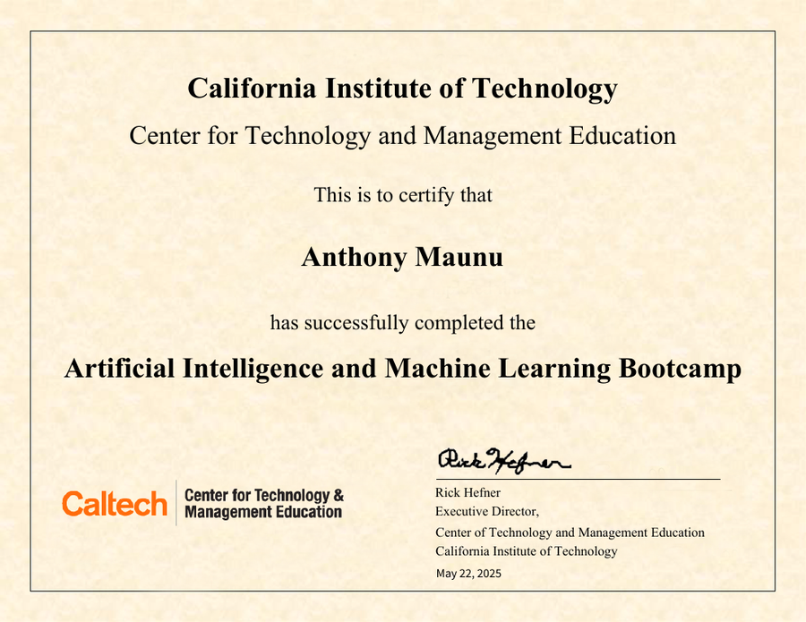</a> 
      <b>Caltech AI/ML Bootcamp</b>
    </td>
    <td align="center" width="180">
      <a href="certificates/caltech-ctme-ai-ml-master-class.pdf">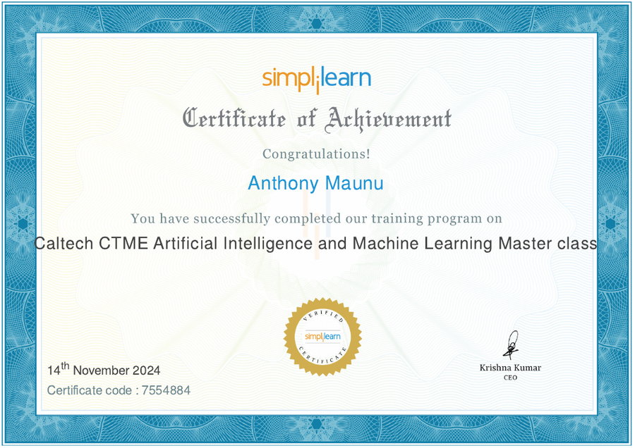</a> 
      <b>Caltech CTME AI/ML Master Class</b>
    </td>
    <td align="center" width="180">
      <a href="certificates/applied-data-science-python.pdf">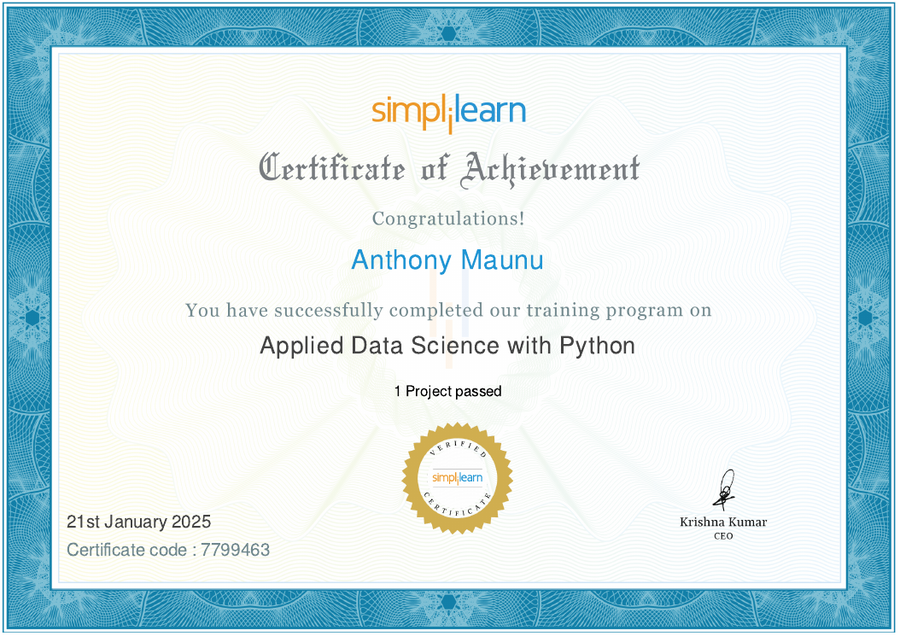</a> 
      <b>Applied Data Science with Python</b>
    </td>
  </tr>
  <tr>
    <td align="center" width="180">
      <a href="certificates/deep-learning-keras-tensorflow.pdf">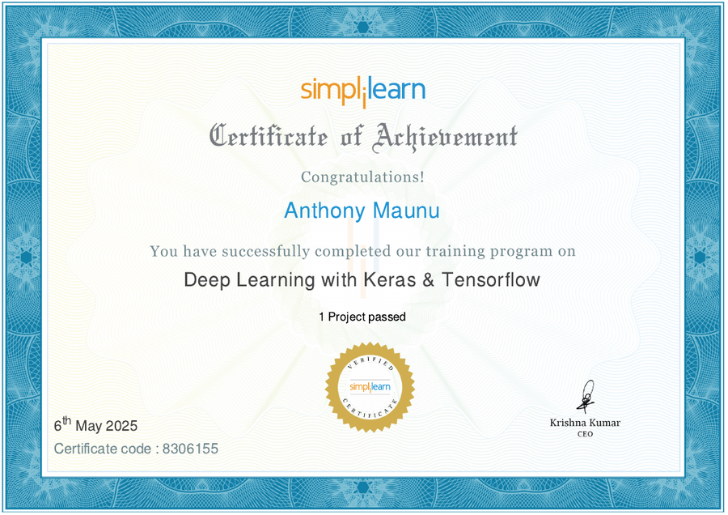</a> 
      <b>Deep Learning with Keras & TensorFlow</b>
    </td>
    <td align="center" width="180">
      <a href="certificates/nlp-speech-recognition.pdf">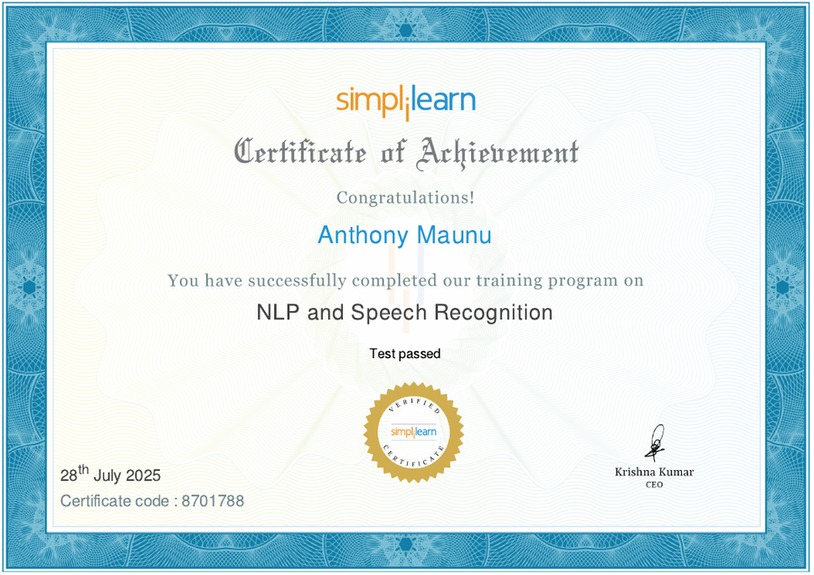</a> 
      <b>NLP & Speech Recognition</b>
    </td>
    <td align="center" width="180">
       
      <b>Programming Refresher</b>
    </td>
  </tr>
</table>
<!-- CERTIFICATIONS-END -->
